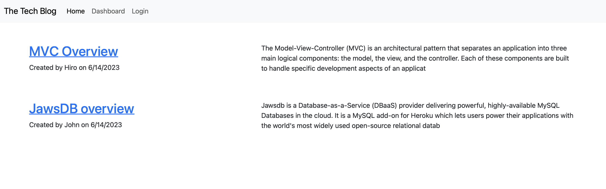
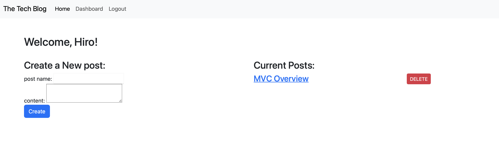
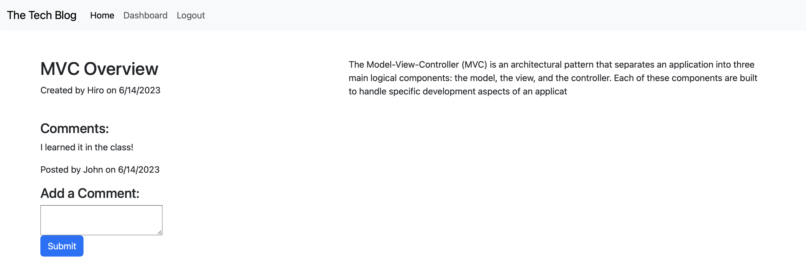

# Tech-Blog

The Tech Blog with Commenting System is a web application that allows users to read and interact with blog articles. Users can view articles, post comments, and engage in discussions with other readers. It provides a platform for sharing knowledge, insights, and opinions in the tech industry.

## Table of Contents

- [Features](#features)
- [Installtion](#installation)
- [Technologies](#technologies)

## Features

- User authentication: Users can sign up, log in, and log out.
- Article management: Users can create, edit, and delete their own articles.
- Commenting system: Users can read and post comments on articles.

## Installation

### Heroku Deployment

1. Access the application in Heroku: [Tech Blog](https://hidden-taiga-98492.herokuapp.com)
2. Sign up or log in to create a new account.
3. Browse the articles, read, and post comments.
4. Create and manage your own articles from the dashboard.

### Local Installation

1. Clone the repository
```
git clone https://github.com/Hiroro1989/Tech-Blog.git
```
2. Navigate to the project directory.
```
cd <saved-directly>
```
3. Install the dependancies.
```
npm install
```
4. set up the database
- Create a .env file
- Create a MySQL database using the provided SQL schema file (schema.sql).
```
mysql -u root -p
```
```
source ./db/schema.sql
```
- update the database connection details in the seed.js file in the seeds.
``` 
node ./seeds/seed.js
```
5. Start the application:
```
node server.js
```
6. Access the application through your brwser.
```
http://localhost:3001/
```
7. Sign up or log in to create a new account.
8. Browse the articles, read, and post comments.
9. Create and manage your own articles from the dashboard.

## Technologies

- Node.js
- Express.js
- bcrypt (for the password harshing and authentication)
- dotenv (for environment management)
- Sequelize (for database interaction)
- Handlebars (for rendering views)
- HTML/CSS (for the frontend)
- JavaScript (for the frontend and backend logic)

## Deployment

[https://hidden-taiga-98492.herokuapp.com](https://hidden-taiga-98492.herokuapp.com)






